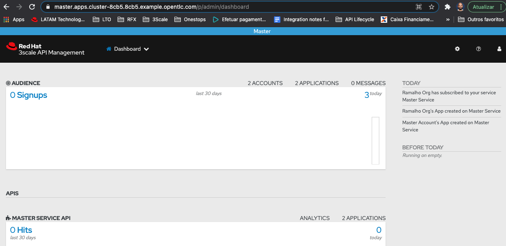
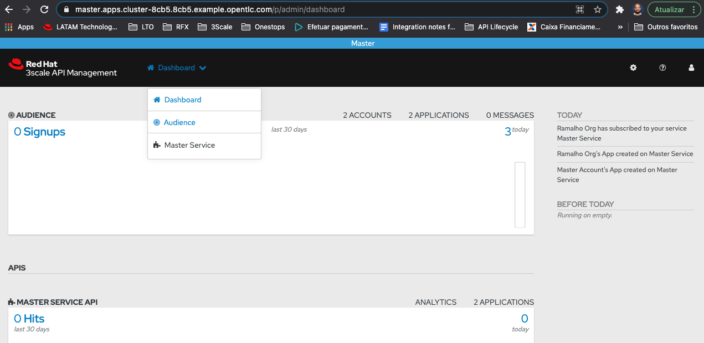
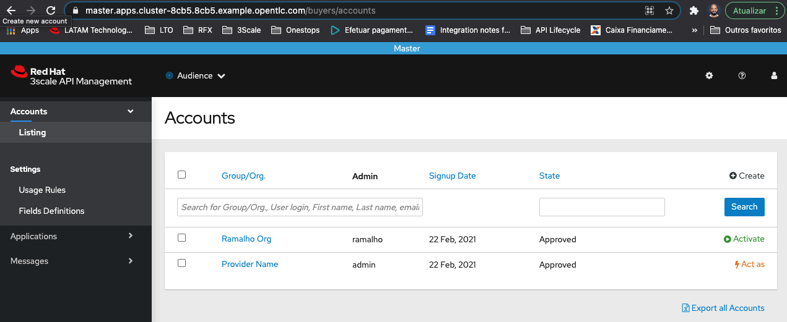
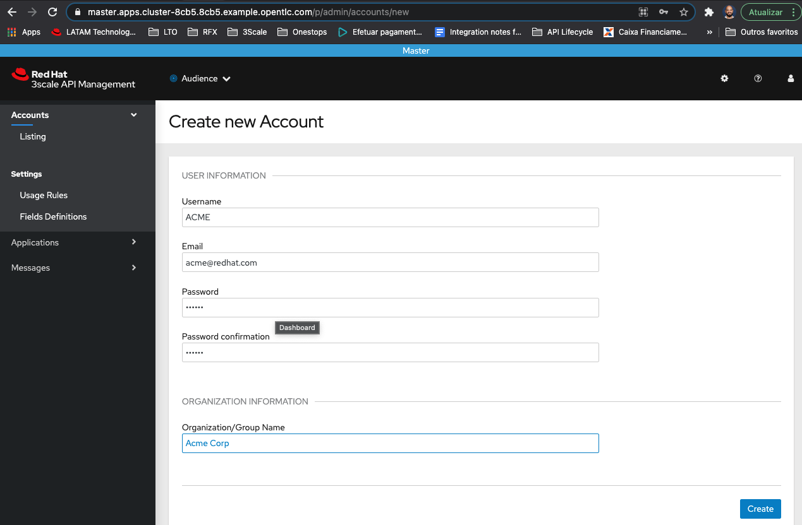
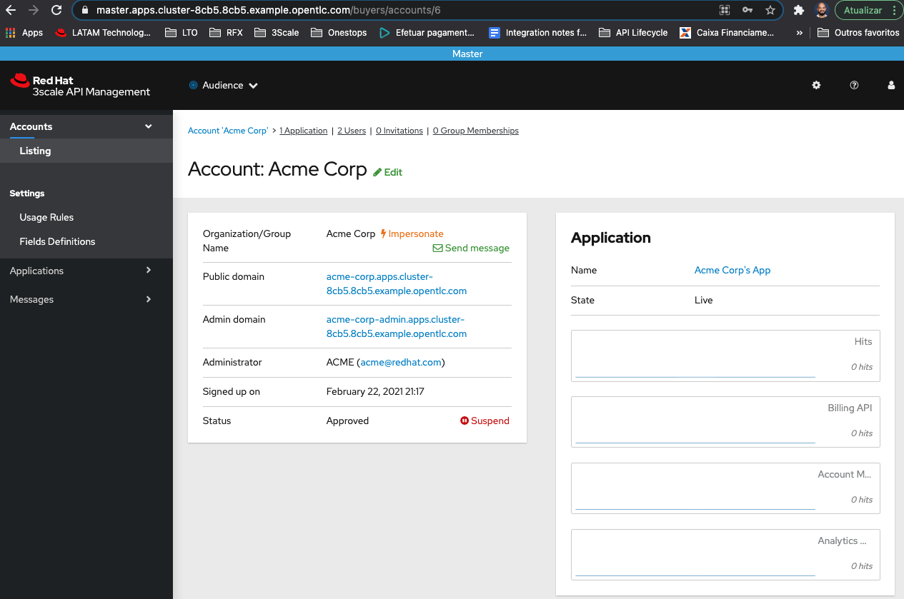
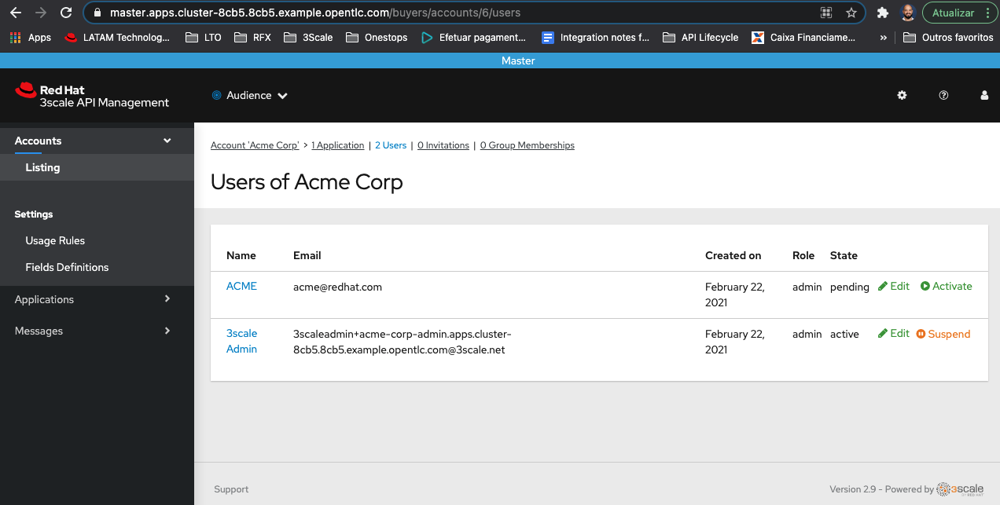
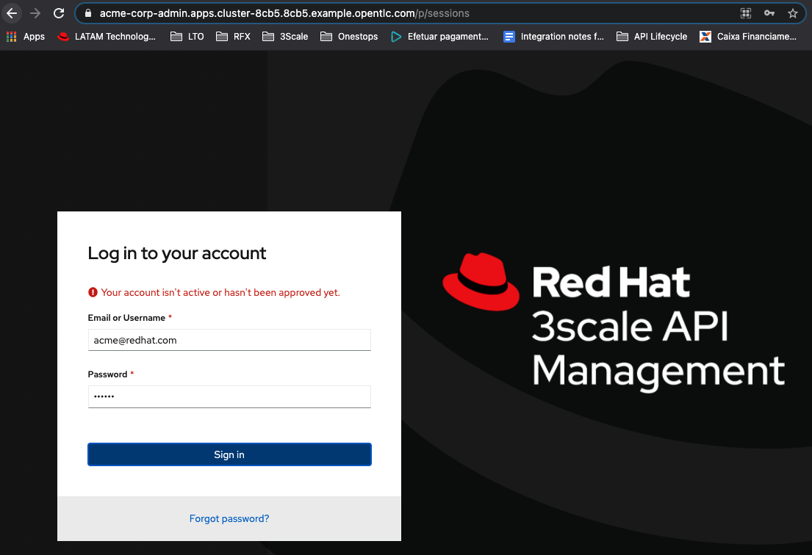
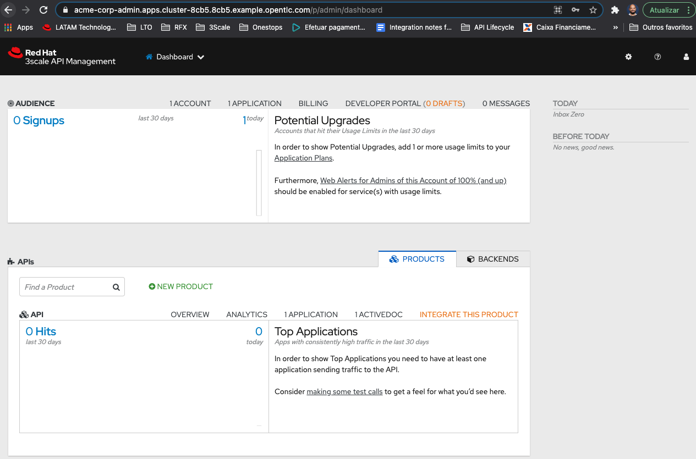
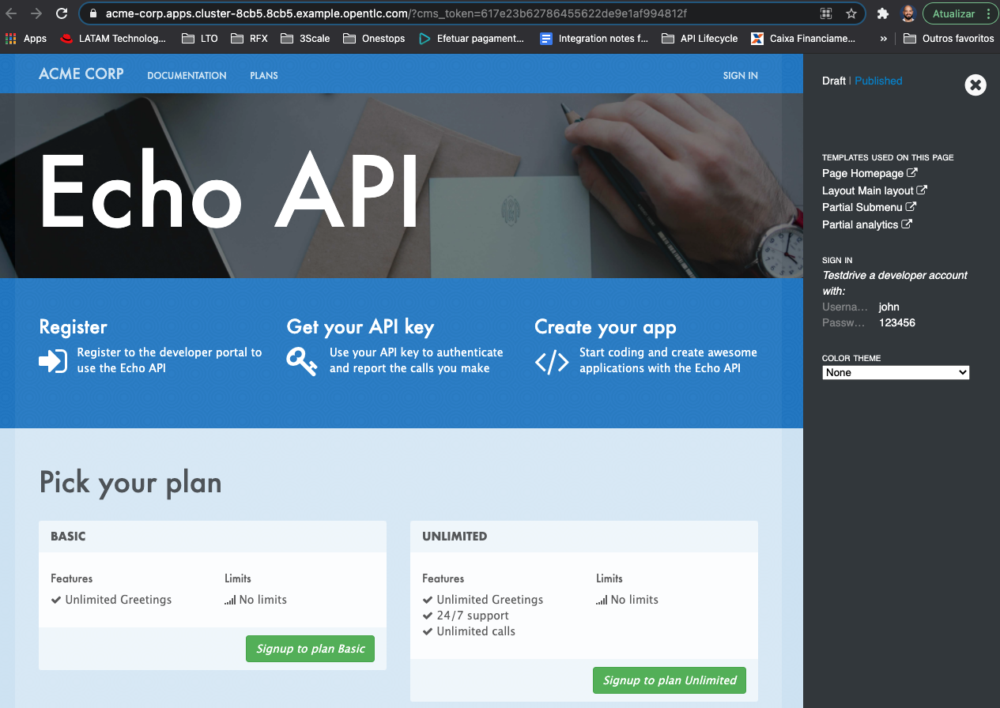
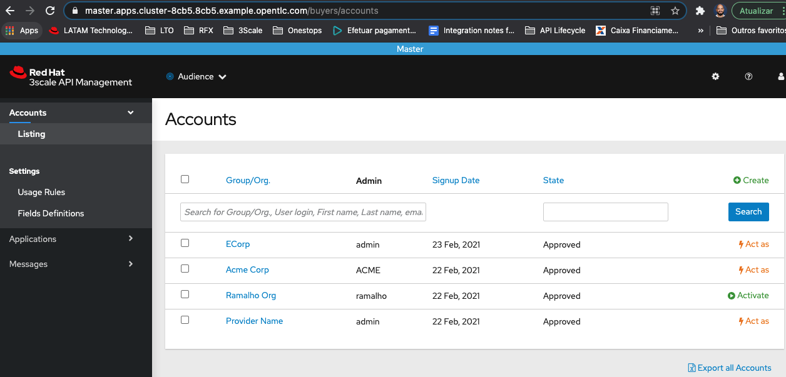

# API Security Workshop

## Multi Tenancy 

Red Hat 3scale API Management allows multiple independent instances of 3scale accounts to exist on a single on-premises deployment. Accounts operate independently from one another, and cannot share information among themselves.

https://access.redhat.com/documentation/en-us/red_hat_3scale_api_management/2.9/html-single/admin_portal_guide/index#multitenancy

* Access the **Master Tenant**:



* Access the **Audience** option from the top menu:



### Create a tenant using the Console Web

* Click in the button **Create** in order to create a new account



* Fill the form with the new tenant information



* Look at the new admin-portal and developer portal link generated at this step. 



* Before to access this link we need to approve the new User created.



* Access the **Admin portal** and log in with the credentials that you provided on the form before.



* Look that you have a new brand admin portal with everything fresh



* Access the developer portal option from the side menu, it's a fresh developer portal.



### Create a tenant using the Tenant CRD

https://github.com/3scale/3scale-operator/blob/master/doc/tenant-reference.md
https://access.redhat.com/documentation/en-us/red_hat_3scale_api_management/2.8/html/operating_3scale/provision-threescale-services-via-operator#deploying-optional-tenants-custom-resource

* You can create a tenant using the CRD

```
oc create -f support/ecorp-admin-secret.yaml
oc create -f support/tenant-crd.yaml
```


