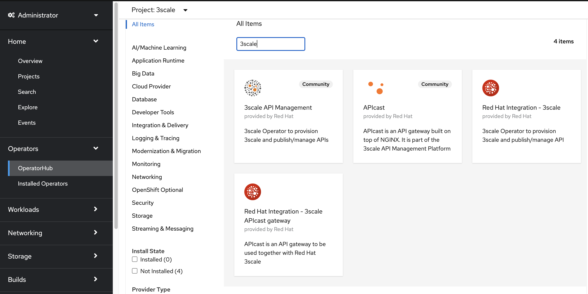
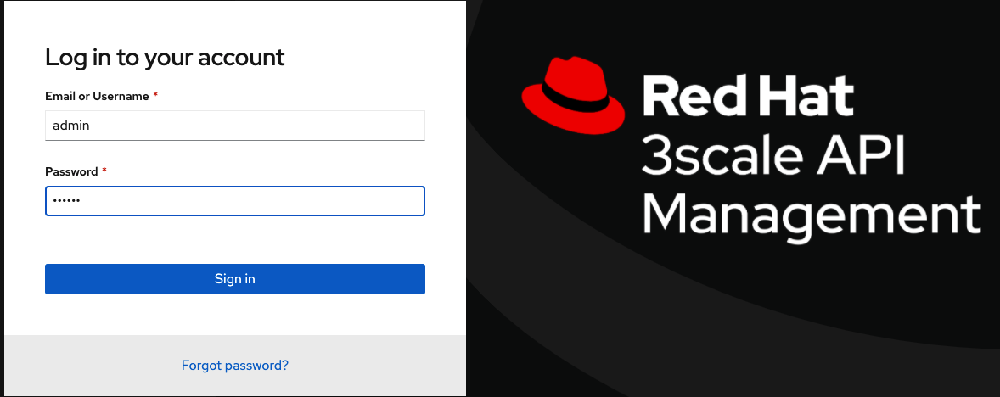
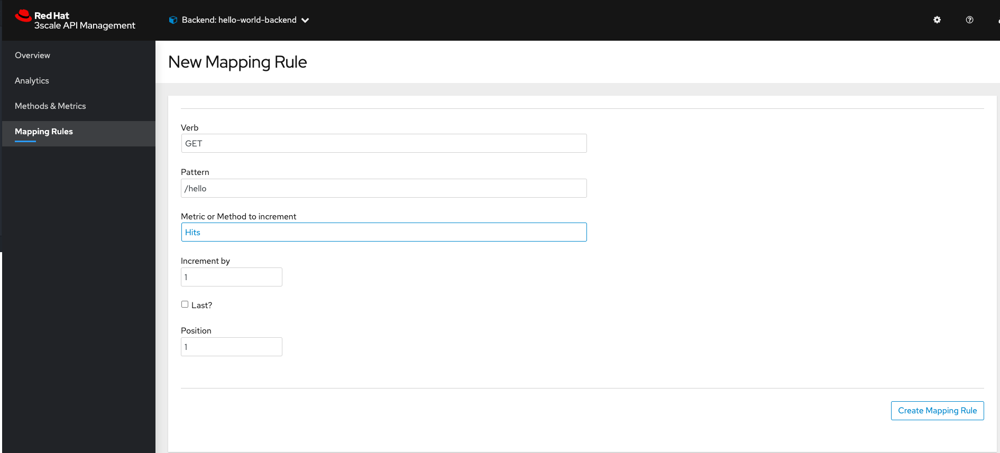
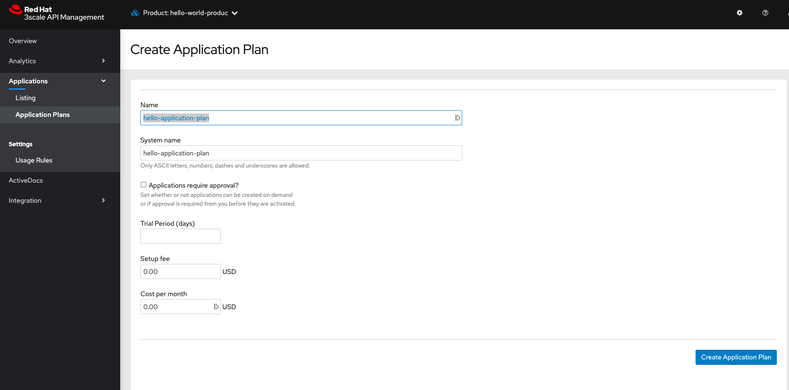
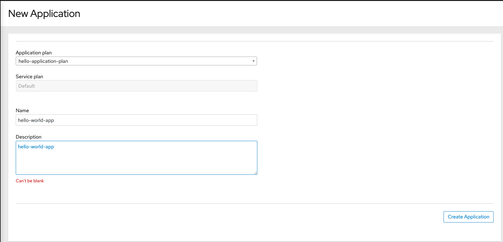

# API Security Workshop

## Description

This Workshop showcase [Red Hat 3Scale API Management](https://www.redhat.com/en/technologies/jboss-middleware/3scale) features leaning towards API Management Security challenges.

The [Additional References](#additional-references) section will provide complementary assets for further reading covering additional details about related topics.

## Environment

- [Red Hat Openshift Container Platform 4.6](https://docs.openshift.com/container-platform/4.6/welcome/index.html)
- [Red Hat 3Scale API Management 2.9](https://www.redhat.com/en/technologies/jboss-middleware/3scale)
- [Openshift Service Mesh 2.0.2](https://www.openshift.com/learn/topics/service-mesh)

## Agenda

0. [Openshift Setup](#deploy-openshift-setup)
1. [3Scale Setup](#deploy-3scale)
2. [Hello World - Backend](#deploy-helloworld-backend)
3. [Hello World - Product](#deploy-helloworld-product)
4. [Hello World - Mapping Rules](#deploy-helloworld-mappingrules)
5. [Hello World - Application Plans](#deploy-helloworld-applicationplans)
6. [Hello World - Application](#deploy-helloworld-application)

## Deployment

### 0 - Openshift Setup <a name="deploy-openshift-setup">

* Create a **3Scale project/namespace**. Example: `oc create namespace 3scale`

* Create a  *Kubernetes secret* to fetch images from **Red Hat´s Registry**. Example: `oc -n 3scale create secret docker-registry threescale-registry-auth --docker-server=registry.redhat.io --docker-username="someuser" --docker-password=password`

* Deploy **3Scale Operator** onto **3Scale project/namespace**:
  `Operators > OperatorHub > Red Hat Integration - 3scale`

  

  

  

  * don´t forget to select **3Scale project/namespace**

* Wait for the installation to finish. Before moving forward, we suggest double-checking the successfully deployment of **3Scale´s Operator**:

  

  

* Via *api-resources:*

  ```
  oc api-resources | grep apimanagers
  apimanagers     apps.3scale.net     true      APIManager
  ```

### 1 - 3Scale Setup <a name="deploy-3scale">

* As stated on [3Scale Operator Guide](https://github.com/3scale/3scale-operator/blob/master/doc/operator-user-guide.md#prerequisites) the following requirements must be met:

  ```
  3 RWO (ReadWriteOnce) persistent volumes
  1 RWX (ReadWriteMany) persistent volume
  3scale's System component needs a RWX(ReadWriteMany) PersistentVolume for its FileStorage when System's FileStorage is configured to be a PVC (default behavior). System's FileStorage characteristics:
    Contains configuration files read by the System component at run-time
    Stores Static files (HTML, CSS, JS, etc) uploaded to System by its CMS feature, for the purpose of creating a Developer Portal
    System can be scaled horizontally with multiple pods uploading and reading said static files, hence the need for a RWX PersistentVolume when APIManager is configured to use PVC as System's FileStorage
  ```

    * When using *RHPDS* you need to deploy an additional *Storage Backend (NFS, OCS, etc)* or create a *PersistentVolumeClaim* in order to sucessfully deploy **3Scale**.

      ```
      apiVersion: v1
      kind: PersistentVolumeClaim
      metadata:
        name: system-storage
        labels:
          app: 3scale-api-management
          threescale_component: system
      spec:
        accessModes:
          - ReadWriteOnce
        resources:
          requests:
            storage: "100Mi"
        storageClassName: gp2
        volumeMode: Filesystem

      oc create -f kubernetes/pvc-storage.yml -n 3scale
      persistentvolumeclaim/system-storage created
      ```

    * if you want to customize **3Scale Password** then create a *Kubernetes Secret* with the following content:

      ```
      apiVersion: v1
      kind: Secret
      metadata:
        name: system-seed
      stringData:
        MASTER_USER: admin
        MASTER_PASSWORD: redhat
        MASTER_ACCESS_TOKEN: redhat
        MASTER_DOMAIN: master
        ADMIN_USER: admin
        ADMIN_PASSWORD: redhat
        ADMIN_ACCESS_TOKEN: redhat
        TENANT_NAME: 3scale
      type: Opaque

      oc create -f kubernetes/seed.yml -n 3scale
      secret/system-seed created
      ```

* In order to deploy **3scale**, navigate to `Operators > Installed Operators > Red Hat Integration 3scale -> API Manager > Create APIManager` and deploy the *API Manager*

  

  

* If you prefer to use the command line, then create an *APIManager Object* as follows:

  ```
  apiVersion: apps.3scale.net/v1alpha1
  kind: APIManager
  metadata:
   name: instance-3scale
  spec:
   wildcardDomain: $domain

  oc create -f kubernetes/api-manager.yml -n 3scale
  ```

  * don´t forget to update the *wildcardDomain* section with your **OpenShift Application domain**
  * when using *RHPDS* it´s recommended to disable *Kubernetes Resource Limits* and *Kubernetes Resource Requests* using [resourceRequirementsEnabled: false](https://github.com/3scale/3scale-operator/blob/master/doc/operator-user-guide.md#resources) property:

    ```
    apiVersion: apps.3scale.net/v1alpha1
    kind: APIManager
    metadata:
     name: instance-3scale
    spec:
     wildcardDomain: $domain
     resourceRequirementsEnabled: false

    oc create -f kubernetes/api-manager.yml -n 3scale
    ```

* Wait until all *pods* are successfully started. A similar output is expected:

  ```
  oc get pods -n 3scale

  NAME                               READY   STATUS      RESTARTS   AGE
  3scale-operator-5f59967f75-vvcdm   1/1     Running     0          80m
  apicast-production-1-29nvc         1/1     Running     0          3m39s
  apicast-production-1-deploy        0/1     Completed   0          4m29s
  apicast-staging-1-deploy           0/1     Completed   0          4m29s
  apicast-staging-1-hjvws            1/1     Running     0          3m39s
  backend-cron-1-deploy              0/1     Completed   0          5m18s
  backend-cron-1-lgbfc               1/1     Running     0          5m15s
  backend-listener-1-deploy          0/1     Completed   0          5m19s
  backend-listener-1-m8r4d           1/1     Running     0          5m15s
  backend-redis-1-5hsh9              1/1     Running     0          5m14s
  backend-redis-1-deploy             0/1     Completed   0          5m17s
  backend-worker-1-deploy            0/1     Completed   0          5m19s
  backend-worker-1-w26rn             1/1     Running     0          5m15s
  system-app-1-deploy                0/1     Completed   0          5m
  system-app-1-hook-post             0/1     Completed   0          71s
  system-app-1-hook-pre              0/1     Completed   0          4m58s
  system-app-1-z5ggv                 3/3     Running     0          2m35s
  system-memcache-1-9lxmj            1/1     Running     0          4m59s
  system-memcache-1-deploy           0/1     Completed   0          5m1s
  system-mysql-1-deploy              0/1     Completed   0          5m16s
  system-mysql-1-j4gzq               1/1     Running     0          5m13s
  system-redis-1-deploy              0/1     Completed   0          5m17s
  system-redis-1-dfmqv               1/1     Running     0          5m14s
  system-sidekiq-1-bvb6k             1/1     Running     0          4m53s
  system-sidekiq-1-deploy            0/1     Completed   0          5m1s
  system-sphinx-1-deploy             0/1     Completed   0          5m
  system-sphinx-1-vzt84              1/1     Running     0          4m58s
  zync-1-7zrx7                       1/1     Running     0          4m44s
  zync-1-deploy                      0/1     Completed   0          4m49s
  zync-database-1-deploy             0/1     Completed   0          4m48s
  zync-database-1-h79m6              1/1     Running     0          4m44s
  zync-que-1-deploy                  0/1     Completed   0          4m49s
  zync-que-1-fklk9                   1/1     Running     2          4m44s

  oc get routes -n 3scale | awk '{ print $1, $2 }'
  NAME HOST/PORT
  backend backend-3scale.apps.cluster-620c.620c.example.opentlc.com
  zync-3scale-api-jk8pl api-3scale-apicast-production.apps.cluster-620c.620c.example.opentlc.com
  zync-3scale-api-rgskr api-3scale-apicast-staging.apps.cluster-620c.620c.example.opentlc.com
  zync-3scale-master-wpct6 master.apps.cluster-620c.620c.example.opentlc.com
  zync-3scale-provider-9csj9 3scale-admin.apps.cluster-620c.620c.example.opentlc.com
  zync-3scale-provider-fr9bk 3scale.apps.cluster-620c.620c.example.opentlc.com

  oc get routes -n 3scale | grep 3scale-admin | awk '{ print $2 }'
  3scale-admin.apps.cluster-620c.620c.example.opentlc.com
  ```

* Try to access **3Scale Admin Portal (e.g https://3scale-admin.apps.cluster-620c.620c.example.opentlc.com/)** with the following credentials: `admin / redhat`

  

  

* If something goes wrong please refer to [Troubleshooting common 3scale installation issues](https://access.redhat.com/documentation/en-us/red_hat_3scale_api_management/2.9/html-single/installing_3scale/index#troubleshooting-common-threescale-installation-issues)

### 2 - Hello World API - Backend <a name="deploy-helloworld-backend">

* On your **3Scale Home Page** create a *Backend* with the following configuration, and click on *Create Backend* afterwards:

  

  ```
  Name: hello-world-backend
  System name: hello-world-backend
  Private Base URL: https://echo-api.3scale.net/
  ```

  

* Switch back to **3Scale Home Page** selecting *Dashboard*

  

* For additional information regarding **3Scale Backend** concept please refer to [3Scale Backend](https://access.redhat.com/documentation/en-us/red_hat_3scale_api_management/2.9/html/glossary/threescale_glossary#backend)

### 3 - Hello World API - Product <a name="deploy-helloworld-product">

* On your **3Scale Home Page** create a *Product* with the following configuration, and click on *Create Product* afterwards:

  

  ```
  Name: hello-world-product
  System name: hello-world-product
  ```

  

* On **hello-world-product** page, click on *Integration -> Configuration* and finally: *add a Backend and promote the configuration*:

  

* Select **hello-world-backend** from *Backend* menu and on the *Path* textbox, inform `/`

  

* Finally click on *Add to Product*

  

* For additional information regarding **3Scale Product** concept please refer to [3Scale Product](https://access.redhat.com/documentation/en-us/red_hat_3scale_api_management/2.9/html/glossary/threescale_glossary#product)

### 4 - Hello World API - Mapping Rules <a name="deploy-helloworld-mappingrules">

* Switch back to **3Scale Home Page** selecting *Dashboard*

  

* Edit **hello-world-backend** configuration: *Backends -> hello world backend*

  

* Click on *Mapping Rules* on the left side menu

  

* Click on *Add Mapping Rule* and add a Rule with the following parameters, and afterwards click on *Create Mapping Rule*

  ```
  Verb: GET
  Pattern: /hello
  Metric or method to increment: Hits
  Increment by: 1.
  Last?: blank
  Position: 1
  ```

  

### 5. Hello World API - Application Plans <a name="deploy-helloworld-applicationplans">

* Switch back to **3Scale Home Page** selecting *Dashboard*

  

* Switch to *Products* tab and click on *HELLO-WORLD-PRODUCT API*

  

* Click on: *Overview -> Applications -> Application Plan*

  

* Click on *Create Application Plan* and define it using the following parameters:

  ```
  Name: hello-application-plan
  System name: hello-application-plan
  ```

  

* Finally set **hello-application-plan** as the *Default Plan* and click on *Publish*

  

  * wait until **hello-application-plan State** is: *published*

### 6. Hello World API - Application <a name="deploy-helloworld-application">

* Switch to **Audience**

  

* Click on *Developer*

  

  

* Click on *1 Application* top link and finally select *Create Application*

  

  

* Define an application with the following configuration and click on *Create Application*

  ```
  Application Plan: hello-application-plan
  Name: hello-world-app
  Description: hello-world-app
  ```

  

  

## Additional References <a name="additional-references">
